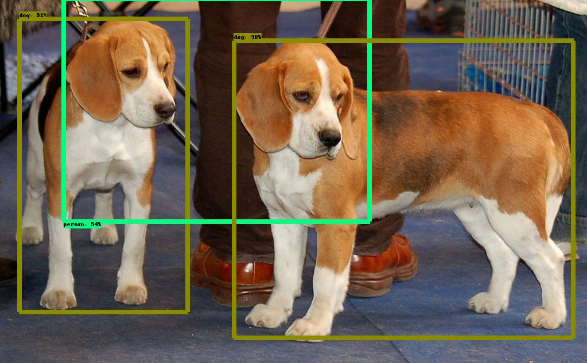

# Setting-up Tensorflow Object Detection API	

### Prerequisites:

* Tensorflow 1.4 or newer  [pip install tensorflow-gpu]
* LabelImage  [https://github.com/tzutalin/labelImg]
* pandas [pip install pandas]
* matplotlib [pip install matplotlib]

### Get the code

Clone objectdetect repository from https://github.com/dotannn/objectdetect
go to utils directory and run download_model sctipt :

```
python download_model.py --model <model_name>
```

if you don't know which model do you want, go to https://github.com/tensorflow/models/blob/master/research/object_detection/g3doc/detection_model_zoo.md  to see a list of optional pre-trained models. or just leave it empty for default model.

Now, test the code by running run_inference.py script. this will run the pretrained model on the sample image in data/sample dir. here's the result:




### Prepare data for training


### Run training and debug results


### Test on new data


